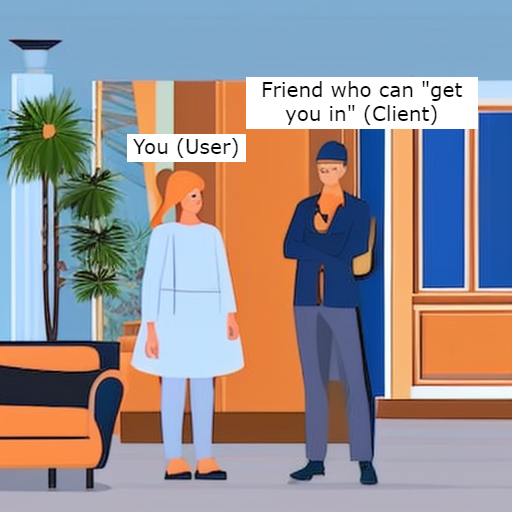
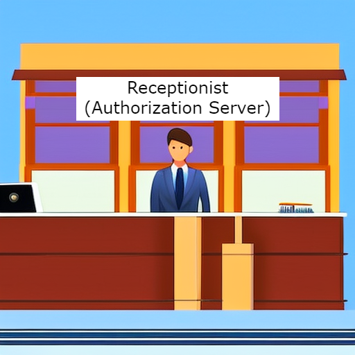
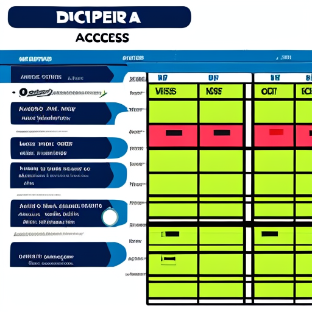
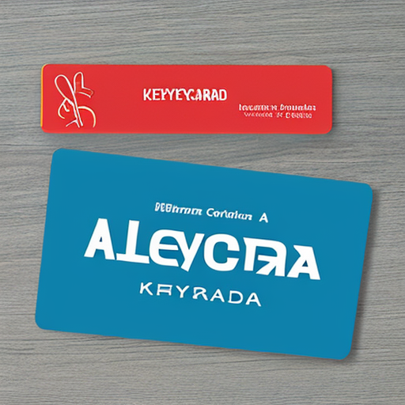
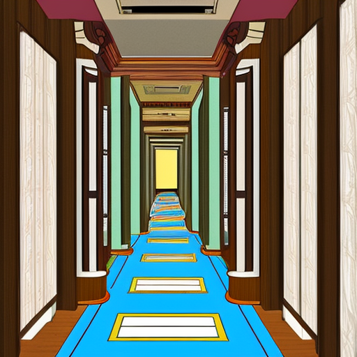
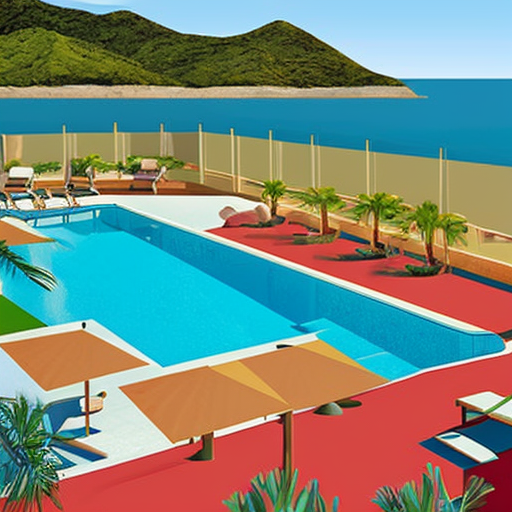
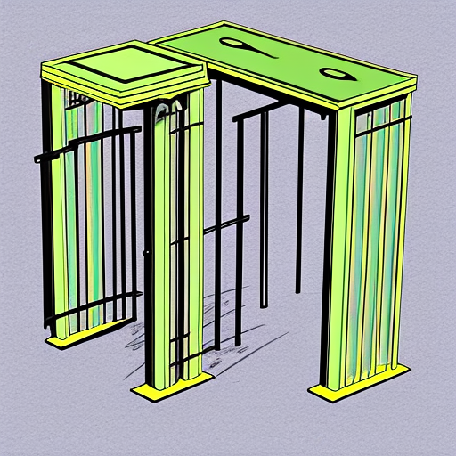
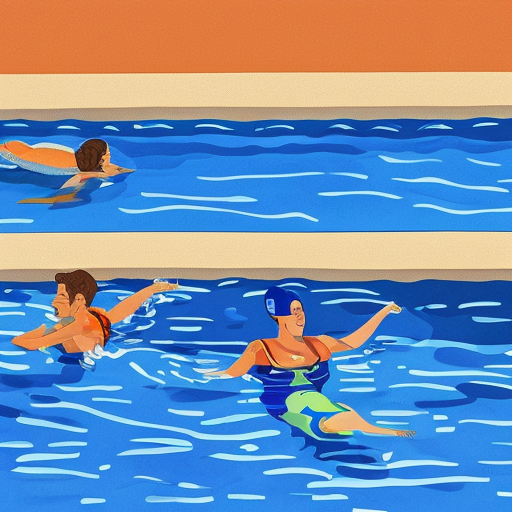

# Oauth example (with a pool)

---

## Setting

- A pool at a hotel
- You want to swim in the pool

---

## A user

---

## A user uses a client

A user cannot do anything on their own directly. With a client, all necessary steps of the OAuth and OIDC protocols are followed.

---

## The client asks the authorization server

Asks for an access token (a key) to the requested resource server (hotel area) and the requested scopes (activities).

---

## Authorization server checks authorization privileges

---

## Authorization server issues an access token (and refresh token)

Kept by the client (friend).

---

## Heading over to the resource server

Does not necessarily have to be in the same place (hotel).

---

## The resource server

A protected area.

---

## Gatekeeper

---

## Using the access token to gain access

The turnstile allows two to pass 😉

---

## Success!

